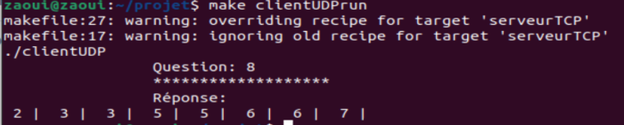
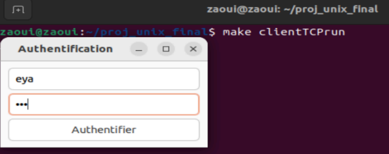
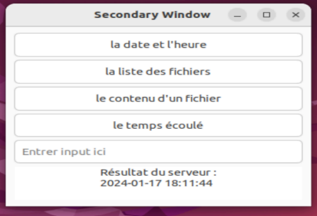
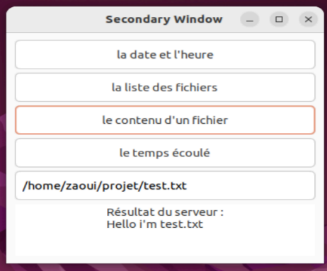
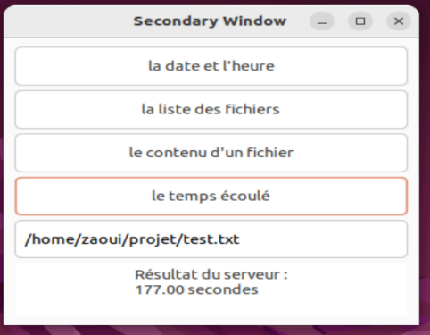

# 🖧 Client/Server Communication System (UDP & TCP)

## 📌 Overview
A client/server communication system built in **C** under **Linux**, using both **UDP** and **TCP** protocols. The project demonstrates how to implement lightweight, fast communication (UDP) and reliable, service-based communication (TCP).

---

## ⚡ Features
### UDP
- Client sends a random number *n* (1 ≤ n ≤ NMAX).
- Server responds with *n* random numbers.

### TCP
- Client interface with:
  - 🔑 Authentication
  - 📜 Service selection
- Server provides services:
  - System date & time
  - Directory file listing
  - File content display
  - Connection duration

---

## 🛠️ Tech Stack
- **Language:** C
- **Platform:** Linux (Ubuntu)
- **Compiler:** GCC
- **Libraries:** Unix Sockets

---

## 📂 Files
```
clientUDP.c
serveurUDP.c
clientTCP.c
serveurTCP.c
```

---

## 🚀 Run
```bash
# UDP
#server Window
make serveurUDPrun
./serveurUDP

#Client window
make clientUDPrun
./clientUDP
```
  


```bash
# TCP
#server Window
make TPC
gcc clientTCP.c -o clientTCP -Wall
gcc serveurTCP.c -o serveurTCP -Wall
make serveurTCPrun
./serveurTCP 3000

#Client window
make clientTCPrun
./clientTCP
```
  
  
  
  
  
  


---

---

## 👩‍💻 Author
**Eya Zaoui**  

💼 AI & Software Engineer | Passionate about Machine Learning, Expert Systems, and Optimization Algorithms  
📧 Email: [zaouieya2@gmail.com](mailto:zaouieya2@gmail.com)  
🔗 LinkedIn: [linkedin.com/in/eya-zaoui](https://www.linkedin.com/in/eya-zaoui) 
